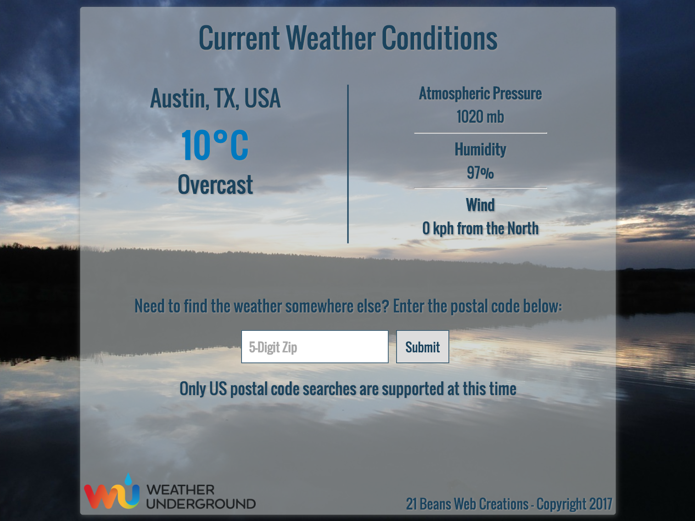

# Local Weather App 
[Live Demo at 21beans.com](http://www.21beans.com/weather)

The Local Weather App automatically checks a user's location using the Weather Underground API and displays the current weather conditions. 
* There is an optional zip code lookup for the user to check the current weather conditions in other locations (this feature only supports US postal codes due to limitations of the Weather Underground API). 
* Temperatures and Wind Speeds are initially displayed in metric units, but the user can switch to imperial units by simply clicking on the temperature. 
* The mobile display shows only the temperature and weather description (clear, cloudy, rain, etc) and hides other data types in order to allow for a clean design and simple user experience.

## Instructions
1. Download repository
2. Double-click `index.html`
3. View in browser

## Technology
* HTML5 & CSS3
* JavaScript

##Dependencies
* jQuery (CDN)
* Google Fonts (CDN)

## Guidelines for Contribution
- This is a learning exercise for me, I greatly appreciate any suggestions or advice 
- Feel free to open a ticket or fork the repository. 
- Please credit back to me if you need to use my code somewhere.

